  <a href="./README.zh-CN.md">简体中文</a> | <strong>English</strong>

<h1 align="center">Kristen Qin</h1>

  Independent builder

  I build small but useful products across AI workflows, design systems, learning tools, and practical automation.

  
  
  
  

## About

- I like turning fuzzy ideas and repetitive workflows into products people can actually use.
- I care about tools that are lightweight, practical, and shippable.
- I usually work across product thinking, frontend implementation, Python tooling, and AI-assisted workflows.

## What I'm Building

### AI x Learning
- [english-practice-app](https://github.com/kristenqin/english-practice-app) - An output-first English learning product designed around real communication, feedback loops, and habit-building.
- `adaptive-focus-system` - A focus support system built around real daily behavior instead of idealized productivity routines.

### Design x Workflow
- [figma-flow-tools](https://github.com/kristenqin/figma-flow-tools) - A toolbox for Figma shortcuts, property learning, token extraction, and design workflow optimization.

### Dev Tools x Process
- [github-repo-organizer](https://github.com/kristenqin/github-repo-organizer) - A repository inventory tool for turning scattered local and remote repos into something reviewable and actionable.
- [git-performance-tool](https://github.com/kristenqin/git-performance-tool) - A tool that turns raw Git history into monthly summaries, progress snapshots, and readable reports.

### Utility x Automation
- [data-to-pdfprint](https://github.com/kristenqin/data-to-pdfprint) - A Python GUI/CLI tool that turns Excel data into production-ready PDF labels.
- [keyword-highlighter](https://github.com/kristenqin/keyword-highlighter) - A rule-based Chrome extension for Chinese web keyword highlighting and faster reading.

## Current Focus

- AI-assisted product workflows
- Figma to code and design system tooling
- learning systems with strong feedback loops
- practical internal tools and micro-products

## Now Playing

  

## GitHub Snapshot

  
  

  

## Connect

- GitHub: [@kristenqin](https://github.com/kristenqin)
- Email: [yqin07184@gmail.com](mailto:yqin07184@gmail.com)

---

If you're building practical AI tools, workflow systems, design-to-code tooling, or learning products, we're probably thinking about similar problems.
